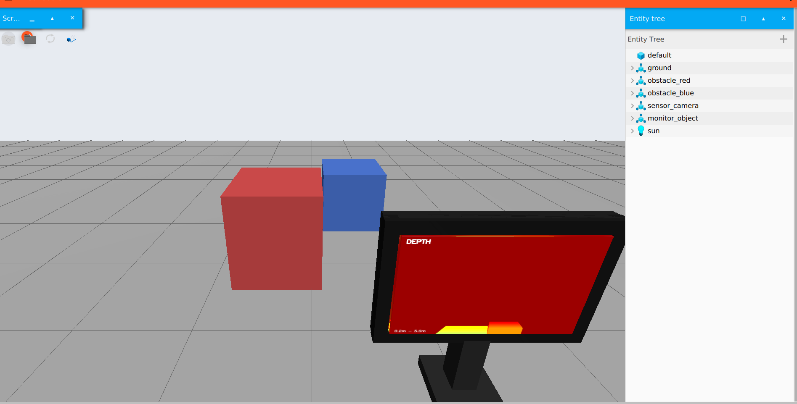

GzSensorMonitor

Real-Time Sensor Feedback Inside Gazebo Harmonic

GzSensorMonitor is a Gazebo Harmonic plugin that enables real-time visualization of simulated sensor data directly inside the Gazebo environment through a virtual monitor.

Instead of switching between Gazebo, RViz, image viewers, or other external visualization tools, GzSensorMonitor brings sensor feedback directly into the simulation, providing a more integrated workflow for robotics simulation, perception development, and sensor debugging.

  

---

🎯 Why GzSensorMonitor?

In a typical robotics simulation workflow, sensor data is often visualized using external tools:

              Gazebo
                |
        Robot + Sensors
                |
        Sensor Feedback
                |
       +--------+--------+
       |                 |
      RViz          Image Viewer

This requires switching between multiple applications while developing and debugging a simulation.

With GzSensorMonitor, sensor feedback is displayed directly inside Gazebo:

                  Gazebo
                    |
             Robot + Sensors
                    |
                    v
             GzSensorMonitor
                    |
                    v
          ┌───────────────────┐
          │      Monitor      │
          │                   │
          │   Live Sensor     │
          │     Feedback      │
          └───────────────────┘

This provides a unified visualization workflow without requiring a separate image viewer.

---

✨ Features

- 📷 RGB Camera Visualization
- 🎥 RGB-D Camera Visualization
- 📏 Depth Image Visualization
- 📡 LiDAR Visualization
- 🖥️ Virtual Monitor Inside Gazebo
- ⚡ Real-Time Sensor Updates
- 🔄 Runtime Sensor Switching
- 🧩 Gazebo GUI + System Plugin Architecture
- 🚫 No Separate Image Viewer Required
- 🤖 Designed for Robotics Simulation and Perception Development
- 🐧 ROS 2 Jazzy + Ubuntu 24.04
- 🌐 Gazebo Harmonic / gz-sim

---

🔄 Runtime Sensor Switching

One of the key features of GzSensorMonitor is the ability to change the displayed sensor while Gazebo is running.

For example:

RGB
 ↓
Depth
 ↓
RGB-D
 ↓
LiDAR
 ↓
RGB

The simulation does not need to be restarted when switching between sensors.

Select RGB

ros2 topic pub --once /sensor_monitor/mode \
std_msgs/msg/String "{data: front_rgb}"

Select Depth

ros2 topic pub --once /sensor_monitor/mode \
std_msgs/msg/String "{data: front_depth}"

Select LiDAR

ros2 topic pub --once /sensor_monitor/mode \
std_msgs/msg/String "{data: front_lidar}"

This makes it possible to inspect different sensor modalities during a single simulation run.

---

⚡ Real-Time Sensor Updates

GzSensorMonitor is designed for live sensor visualization with an emphasis on keeping the Gazebo interface responsive.

The sensor data flow is:

        Sensor Frame
             |
             v
   Gazebo Sensor Callback
             |
             v
      Frame Processing
             |
             v
    Latest Display Frame
             |
             v
        Gazebo GUI
             |
             v
       Monitor Texture

The monitor prioritizes the latest available sensor frame.

If sensor data arrives faster than the renderer can display it, intermediate frames may be skipped rather than blocking the sensor processing pipeline.

This approach helps maintain a responsive visualization experience during high-frequency sensor simulation.

---

🏗️ Architecture

GzSensorMonitor consists of two primary components:

                    Gazebo Harmonic
                           |
             +-------------+-------------+
             |                           |
             v                           v
       System Plugin                GUI Plugin
             |                           |
             v                           v
       Sensor Data                  Rendering
             |                           |
             v                           v
       Frame Processing          Monitor Visual
             |                           |
             +-------------+-------------+
                           |
                           v
                    Live Sensor Feed

System Plugin

The system plugin is responsible for:

- Accessing simulated sensor data
- Receiving sensor callbacks
- Processing incoming frames
- Managing the latest available sensor frame
- Handling sensor selection and runtime switching

GUI Plugin

The GUI plugin is responsible for:

- Rendering the virtual monitor
- Displaying the latest processed sensor frame
- Updating the monitor texture
- Providing visualization directly inside Gazebo

---

📋 Requirements

GzSensorMonitor has been developed and tested with the following environment:

Component| Version
Operating System| Ubuntu 24.04
ROS 2| Jazzy
Gazebo| Harmonic
Language| C++17
Build System| CMake
Build Tool| colcon

«Note: This project targets modern Gazebo ("gz-sim") and is not intended for Gazebo Classic.»

---

📦 Installation

1. Create a ROS 2 Workspace

mkdir -p ~/gz_sensor_monitor_ws/src
cd ~/gz_sensor_monitor_ws/src

2. Clone the Repository

git clone https://github.com/Aachal-Sharma/gz_sensor_monitor.git

3. Source ROS 2 Jazzy

source /opt/ros/jazzy/setup.bash

---

🔨 Build

Navigate to the workspace:

cd ~/gz_sensor_monitor_ws

Source ROS 2 Jazzy:

source /opt/ros/jazzy/setup.bash

Build the package:

colcon build --symlink-install \
  --packages-select gz_sensor_monitor

Source the workspace:

source install/setup.bash

---

⚙️ Configure Gazebo Plugin Paths

Set the Gazebo System Plugin path:

export GZ_SIM_SYSTEM_PLUGIN_PATH=$HOME/gz_sensor_monitor_ws/install/gz_sensor_monitor/lib

Set the Gazebo GUI Plugin path:

export GZ_GUI_PLUGIN_PATH=$HOME/gz_sensor_monitor_ws/install/gz_sensor_monitor/lib

For convenience, these environment variables can also be added to your shell configuration:

echo 'export GZ_SIM_SYSTEM_PLUGIN_PATH=$HOME/gz_sensor_monitor_ws/install/gz_sensor_monitor/lib' >> ~/.bashrc
echo 'export GZ_GUI_PLUGIN_PATH=$HOME/gz_sensor_monitor_ws/install/gz_sensor_monitor/lib' >> ~/.bashrc
source ~/.bashrc

---

🚀 Usage

After building the package and configuring the Gazebo plugin paths, launch your Gazebo Harmonic simulation containing the supported sensors.

Once GzSensorMonitor is loaded, the virtual monitor can display sensor feedback directly inside the Gazebo interface.

Sensor modes can be changed at runtime using the ROS 2 topic:

/sensor_monitor/mode

For example:

ros2 topic pub --once /sensor_monitor/mode \
std_msgs/msg/String "{data: front_rgb}"

or:

ros2 topic pub --once /sensor_monitor/mode \
std_msgs/msg/String "{data: front_depth}"

---

🧪 Example Sensor Modes

Sensor| Example Mode
RGB Camera| "front_rgb"
Depth Camera| "front_depth"
LiDAR| "front_lidar"

Additional sensor modes can be supported depending on the configured simulation and plugin implementation.

---

🤖 Use Cases

GzSensorMonitor can be useful for:

- Robotics simulation
- Computer vision development
- Sensor debugging
- Perception algorithm development
- Autonomous robot development
- Gazebo sensor testing
- RGB/RGB-D camera development
- LiDAR visualization
- Simulation demonstrations
- Research and academic projects

---

👨‍💻 Authors

Aachal Sharma
Rahul Gupta

---

📜 License

See the repository for the applicable license information.

---

⭐ Acknowledgements

GzSensorMonitor is developed around the Gazebo Harmonic and ROS 2 ecosystems, with the goal of simplifying sensor visualization and improving the development workflow for robotics simulation and perception applications.

---

📚 Citation

If you use GzSensorMonitor in your research, project, or publication, please cite:

@software{sharma_gz_sensor_monitor,
  author  = {Aachal Sharma and Rahul Gupta},
  title   = {GzSensorMonitor: Real-Time Sensor Feedback Inside Gazebo Harmonic},
  year    = {2026},
  url     = {https://github.com/Aachal-Sharma/gz_sensor_monitor}
}

---

🌟 Contributing

Contributions, suggestions, bug reports, and feature requests are welcome.

If you would like to contribute, please open an issue or submit a pull request through the GitHub repository.

---

📌 Project Summary

GzSensorMonitor brings real-time simulated sensor visualization directly into Gazebo Harmonic, eliminating the need to switch between multiple visualization applications.

With support for RGB, RGB-D, Depth, and LiDAR visualization, together with runtime sensor switching and a Gazebo GUI + System Plugin architecture, the project provides an integrated solution for robotics simulation and perception development.

Gazebo + Sensors + Visualization — all in one environment.
